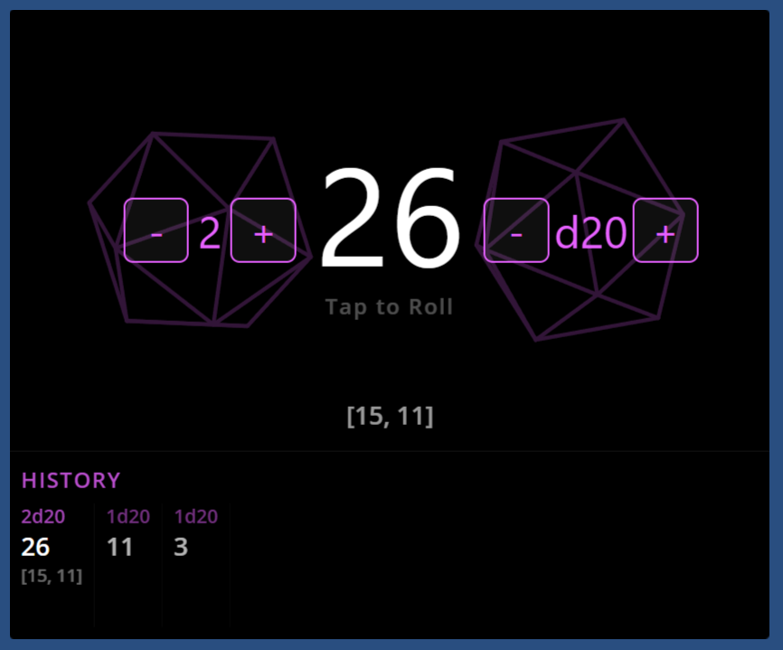

# QK Dice Roller - iCUE Dashboard Widget

An interactive dice rolling widget for the **Corsair Xeneon Edge** touchscreen, built for iCUE's LCD widget system. Tap to roll any standard polyhedral die, with spinning 3D wireframe dice and roll history.

---

## How It Works

Tap the dice area to roll. The widget supports d4, d6, d8, d10, d12, d20, and d100, rolling up to 10 dice at once with individual results and totals. Previous rolls are tracked in a history panel. Runs entirely within iCUE with no external dependencies.

### In-Widget Controls

Dice type and count are adjustable directly on the widget using +/- buttons in standard dice notation format: `[-] 1 [+]  [-] d20 [+]`. The left control sets how many dice to roll (1-10), the right control cycles through dice types.

### 3D Wireframe Backdrop

A spinning wireframe of the selected die rotates behind the result. Each die type renders as its actual polyhedron: tetrahedron (d4), cube (d6), octahedron (d8), pentagonal trapezohedron (d10), dodecahedron (d12), and icosahedron (d20). The d100 uses a static overlapping-circles shape.

- Orthographic projection with backface culling (Newell's method)
- 3D tumbling with random axis drift for realistic motion
- Roll animation at 60 rad/s with exponential deceleration to idle
- Fixed-scale rendering based on circumradius to prevent visual distortion
- d10 uses mathematically derived planar kite faces with 90-degree side angles
- Multi-dice wireframes arranged in a grid layout (e.g., 3x3 for 9 dice)

---

## Requirements

- Corsair iCUE (built and tested on 5.41.42)
- Corsair Xeneon Edge (or compatible dashboard LCD with touchscreen)

---

## Setup

1. Download the ZIP file from the [Releases](https://github.com/QuadraKev/qk-dice-roller/releases) page.
2. Extract its contents into your iCUE widgets directory (typically `C:\Program Files\Corsair\Corsair iCUE5 Software\widgets`).
3. Restart iCUE for the new widget to appear in the widget picker.
4. Add the widget to your Xeneon Edge dashboard in iCUE.
5. Tap anywhere on the widget to roll.

---

## Settings

| Setting | Description |
|---------|-------------|
| **Show History** | Toggle the roll history panel |
| **Text Color** | Color for result numbers and text |
| **Accent Color** | Color for dice wireframe, controls, and history headers |
| **Background Color** | Widget background color |
| **Transparency** | Background transparency (0-100%) |

---

## Layout

The widget adapts to all Xeneon Edge slot sizes:

### Horizontal

- **S** (840x344): history hidden; controls and result scaled up to match the physical size of other slots
- **M** (840x696): dice area on top, history scrolls horizontally below
- **L** (1688x696): dice area on the left, history panel on the right
- **XL** (2536x696): same as L with more horizontal space

### Vertical (Portrait)

- **S** (696x416): history hidden; controls flanking dice, vw-based sizing to fit narrower width
- **M** (696x840): vertically stacked layout (result, controls, history below)
- **L** (696x1688): same stacking with more history space
- **XL** (696x2536): same as L with extended history area

When rolling multiple dice, individual results appear below the total (e.g., [4, 8, 5]).

---

## Troubleshooting

**Widget doesn't respond to taps**
- Requires a touchscreen display (Xeneon Edge). The `x-icue-interactive` meta tag is included.

**Results seem non-random**
- Uses `Math.random()` for adequate casual randomness. Not intended for cryptographic use.
